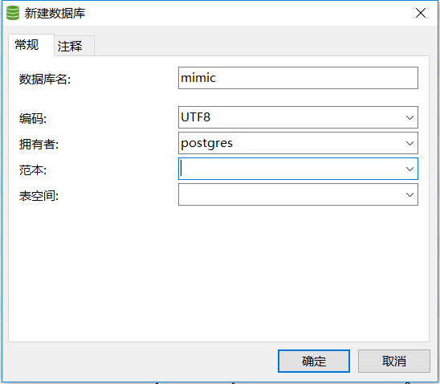

# 构建文档

## 数据准备

* 数据下载链接 _______(待填写)

## 数据库环境准备

* postgresql数据库环境，下载链接：https://www.postgresql.org/download/windows/

一直下一步，

* navicat下载，下载链接: _______(待填写)

## 代码准备

https://github.com/MIT-LCP/mimic-code

## 数据导入(基于代码)

1. 创建数据库

    * 打开navicat，新建连接，选择postgres，输入密码

    

    * 创建数据库

    

2. 登录数据库

打开sql shell软件，打开之后是一个黑框框。

2. 创建表格

    * 代码文件下的`buildmimic/postgres/postgres_create_tables_pg10.sql`
    全选复制，粘贴到刚才打开的黑框框中

    
